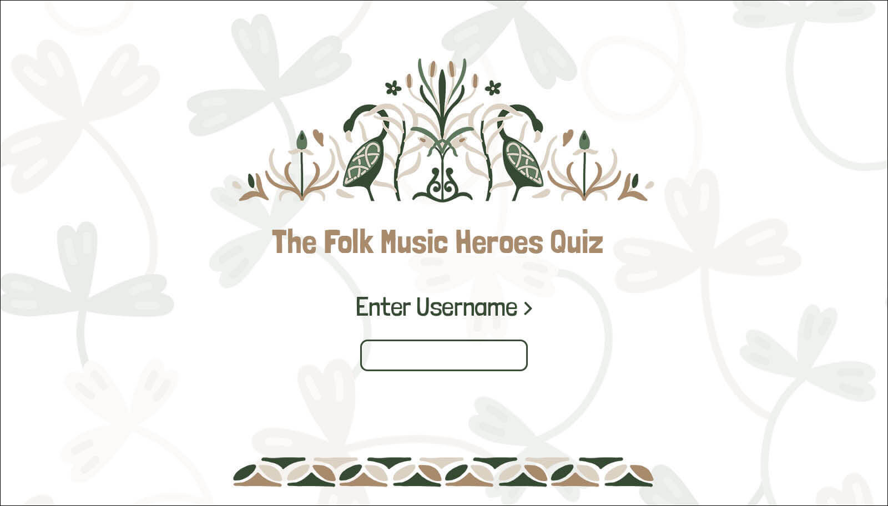
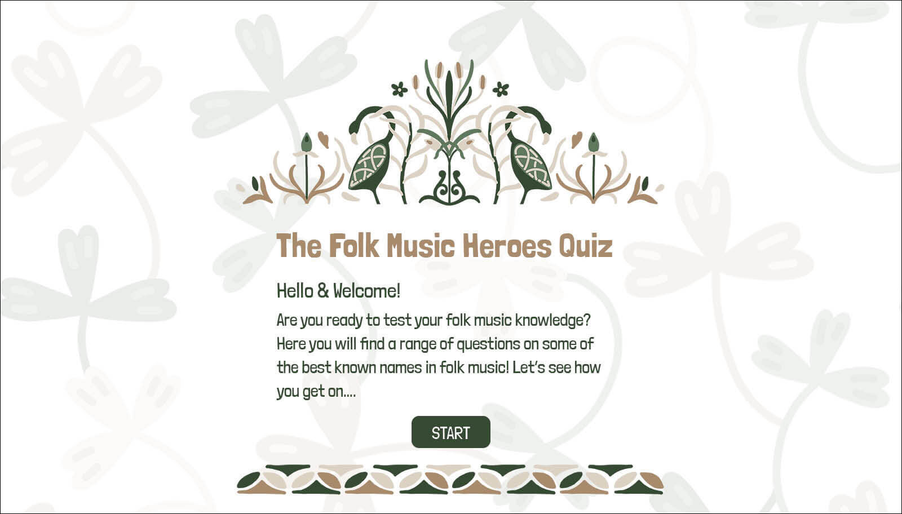
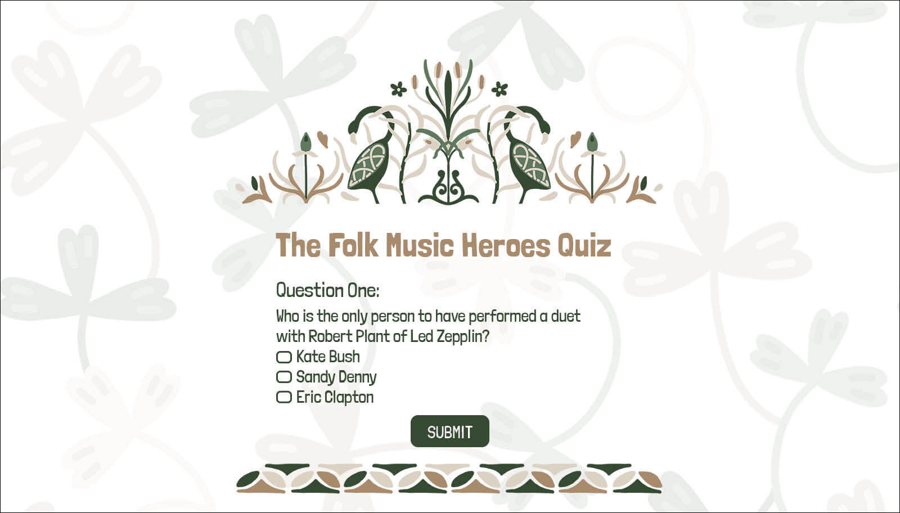
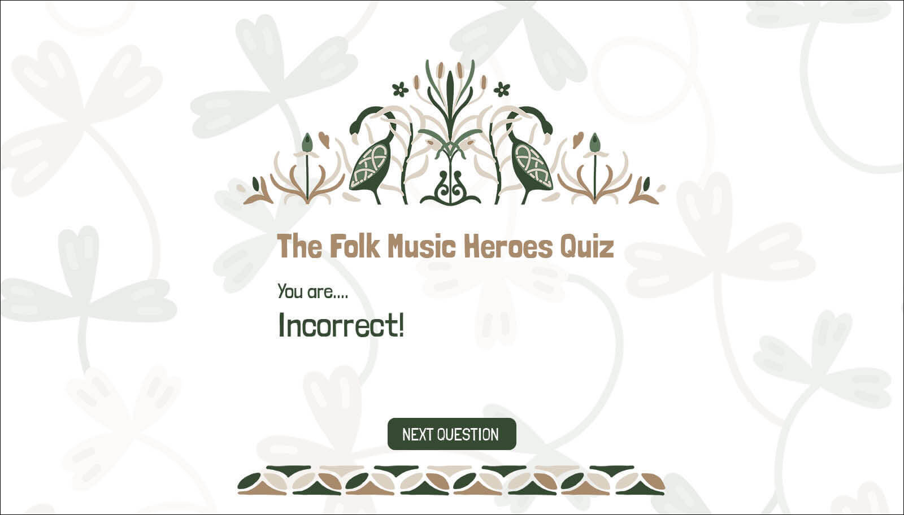
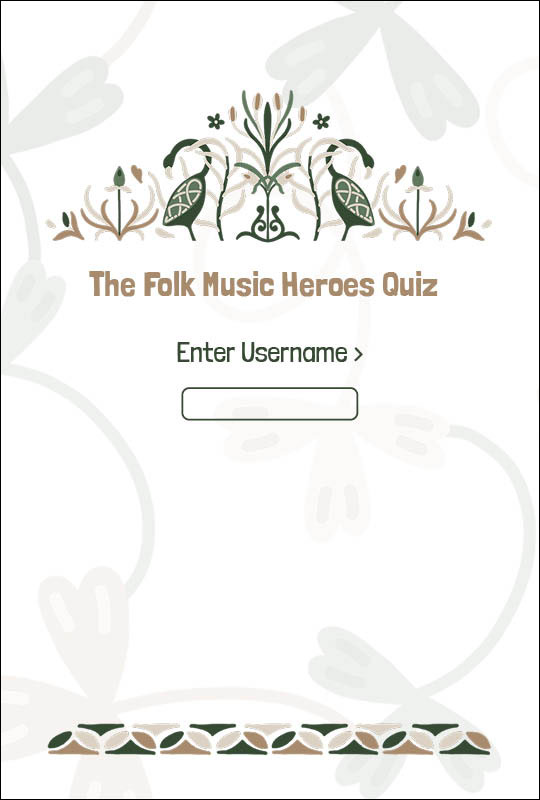
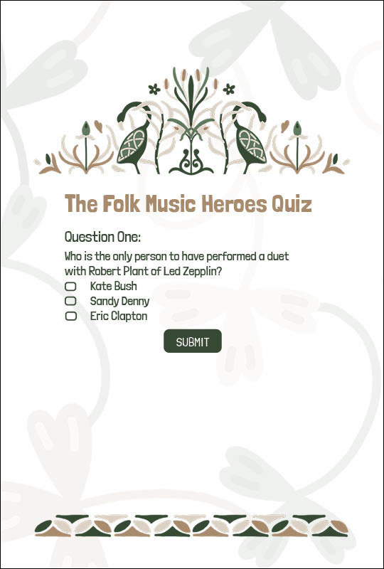
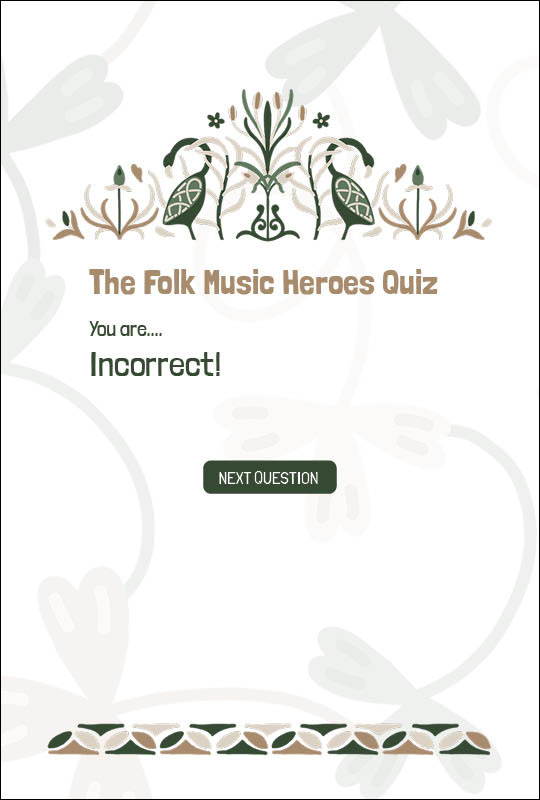
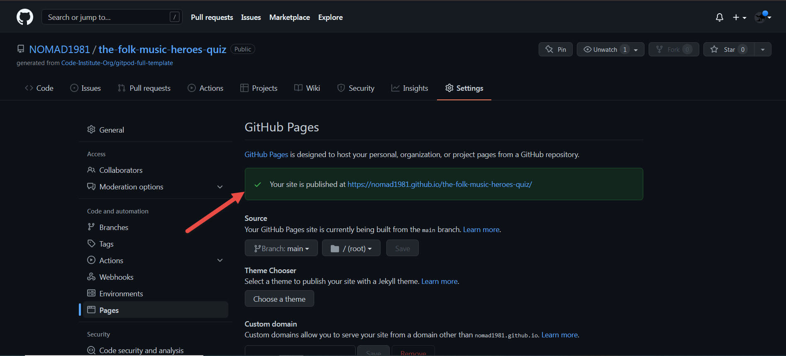

# The Folk Music Heroes Quiz
An interactive web page to test the users folk music knowledge. The quiz requires the user to answer 10 folk music related questions, generated randomly from a list of 30.

Click [here](https://nomad1981.github.io/the-folk-music-heroes-quiz/) to test your folk music knowledge! 

# Contents
* [**User Experience UX**](<#user-experience-ux>)
    * [**User Stories**](<#user-stories>)
    * [**Wireframes**](<#wireframes>)
        * [**Desktop Wireframes**](<#desktop-wireframes>)
        * [**Mobile/Devices Wireframes**](<#smaller-devices-wireframes>)
    * [**Site Structure**](<#site-structure>)
    * [**Design Choices**](<#design-choices>)
	    *  [**Illustrative Graphics**](<#illustrative-graphics>)
        *  [**Typography**](<#typography>)
        *  [**Colour Scheme**](<#colour-scheme>)
* [**Features**](<#features>)
    * [**Quiz Structure and Function**](<#quiz-structure-and-function>)
        * [**Welcome Section**](<#welcome-section>)
        * [**Quiz and Score Sections**](<#quiz-and-score-sections>)
        * [**Quiz Completion**](<#quiz-completion>)
    * [**Removed Features**](<#removed-features>)
    * [**Future Features**](<#future-features>)
* [**Technologies Used**](<#technologies-used>)
* [**Testing**](<#testing>)
    * [**Code Validation**](<#code-validation>)
    * [**Responsiveness**](<#responsiveness>)
    * [**Browser Compatibility**](<#browser-compatibility>)
    * [**User Stories**](<#user-stories>)
    * [**Known Bugs**](<#known-bugs>)
        * [**Resolved**](<#resolved>)
        * [**Unresolved**](<#unresolved>)
    * [**Additional Testing**](<#additional-testing>)
        * [**Lighthouse**](<#lighthouse>)
        * [**Peer Code Review**](<#peer-code-review>)
* [**Deployment**](<#deployment>)
    * [**Deploy the Project**](<#deploy-the-project>)
    * [**For a Repository on GitHub**](<#fork-a-repository-on-github>)
    * [**Create a Local Clone**](<#create-a-local-clone>)
* [**Credits**](<#credits>)
    * [**Development Issues**](<#development-issues>)
    * [**Audio**](<#audio>)
*  [**Acknowledgements**](<#acknowledgements>)

# User Experience (UX)
## User Stories
* The user will want to know how long the quiz is, or how many questions they are required to answer.
* The user will want to know the score, with a log of correct and incorrect answers, along with a tally of how many questions they have answered so far.
* The user will want to know when the quiz is complete.
* The user may wish to try again to improve their score.
* The user may wish to listen to a nice folk music compilation on completion, which they can do if they wish.
* The user would like to be presented with an aesthetically pleasing and easy to navigate web page.

[Back to top](<#contents>)

## Wireframes
Initial wireframes were created in InDesign for a basic visual of pages on desktop and smaller devices. Some design choices and quiz struture changed during production, but the overall feel of the quiz remains the same.

### **Desktop Wireframes**
  <tr>
    <td></td>
    <td></td>
    <td></td>
    <td></td>
    <td></td>
    <td></td>
    <td></td>
  </tr>

[Back to top](<#contents>)

### **Smaller Devices Wireframes**
 <tr>
    <td></td>
    <td></td>
    <td></td>
    <td></td>
    <td></td>
    <td></td>
    <td></td>
  </tr>
[Back to top](<#contents>)

## Site Structure
The Folk Music Heroes Quiz is a one page site, with sections shown and hidden based on user button clicks to proceed through the quiz.
The user must firstly enter a username, which will then be populated into the welcome message once submitted. The welcome message includes a brief overview on how to proceed, and the number of questions in the quiz. The start button plays a guitar strum audio and then the quiz section opens. 
Questions are presented one by one, and the score tally area is visible throughout. Each answer submission is followed by an alert using the alert box styling from [Sweetalert2](https://sweetalert2.github.io/)
Once the quiz is complete the user can choose to try again, or they have the option to play some music. The '[try again](https://nomad1981.github.io/the-folk-music-heroes-quiz/)' button brings them back to the start, while the '[play music](https://www.youtube.com/watch?v=6gzuP2hgR3s)' button brings them to a folk music classics compilation on YouTube.

### Questions and Answers were heavily researched, with the following links used:

* [funtrivia.com American Folk Music Quiz](https://www.funtrivia.com/trivia-quiz/Music/American-Folk-Music-153371.html)
* [irishtrivia.com Music Quiz](https://irishtrivia.com/irish-music.htm)
* [study.com What is Folk Music](https://study.com/academy/lesson/what-is-folk-music-definition-artists-history.html)
* [encyclopaediaoftrivia.blogspot.com Folk Song](https://encyclopaediaoftrivia.blogspot.com/2015/02/folk-song.html)
* [wikipedia.org Liam_Clancy](https://en.wikipedia.org/wiki/Liam_Clancy)
* [worldmusic.net The Folk Music of England: Roots and Revival](https://worldmusic.net/blogs/guide-to-world-music/the-folk-music-of-england-roots-and-revival)
* [funtrivia.com Woodstock Spirit Quiz](https://www.funtrivia.com/trivia-quiz/Music/Woodstock-Spirit-of-69-307697.html)
* [play.howstuffworks.com Woodstock Performers Quiz](https://play.howstuffworks.com/quiz/woodstock-performers-quiz)
* [woodstock.com Lineup](https://www.woodstock.com/lineup/)
* [wikipedia.org Fairport Convention](https://en.wikipedia.org/wiki/Fairport_Convention)
* [m.imdb.com nm0593474 Trivia](https://m.imdb.com/name/nm0593474/trivia)
* [m.imdb.com nm2489930 Trivia](https://m.imdb.com/name/nm2489930/trivia)

[Back to top](<#contents>)

## Design Choices
* ### Illustrative Graphics
    * The illustrative graphics were chosen based on the suitability for the project. These 'International Branding' resources were purchased through [DesignCuts](https://www.designcuts.com/product/the-international-brand-collection/) for use in my own client graphic projects. I have chosen the Celtic style branding for use here, for it's earthy tones and its long history of usage in folk/traditional music promotion and branding. The overall design feel is clean and modern, with muted, earthy colour usage.

* ### Typography
    * The font used throughout is [Londrina Solid](https://fonts.google.com/specimen/Londrina+Solid#about), a cursive style font referred to as 'New Folk'. It is used as different sizes and weights. This font adds to the folky feel of the overall design, and fits the illustrative style graphics with it's imperfect edges.

* ### Colour Scheme
    * The colour palette is the same used in the illustrative graphics; resources purchased through [DesignCuts](https://www.designcuts.com/product/the-international-brand-collection/) for use in my own client graphic projects (as mentioned above). The colours have an earthy feel to suit the folk related theme of the site. 

The colour palette:

[Back to top](<#contents>)
# Features
## Quiz Structure and Function
* ### User input section
    * The user is met with the overall graphic elements to frame the screen throughout, and a user input area to enter their username.
    * Once the user has submitted their username, the section is hidden and they provided with the welcome section.

[Back to top](<#contents>)
* ### Welcome section
    * The welcome section provides the user with a welcome message the populates their username value from the previous screen, to personalise their experience.
    * The process of completing the quiz is explained; they will answer 10 folk music related questions.
    * Due to the nature of the quiz, difficulty levels are deliberately not included. As it is a niche subject, the questions asked are all on the higher level of difficulty, unless the user is a folk music expert.
    * The user is invited to click start to get the quiz running, the section is then hidden and a guitar strum audio sound is provided on click.

[Back to top](<#contents>)
* ### Quiz and score sections
    * The quiz section is presented to the user at the top of the screen, with a score area visible below.
    * The quiz is navigated questions by question, whereby the user selects a choice through radio button and clicks submit answer, then the next question is populated.
    * The score area keeps tally as the user progresses through the quiz. It includes the correct answer count (which increments numeric values in green), the incorrect count (which increments numeric values in red), and the total questions answered, until 10 questions are reached.
    * Questions are populated randomly from an array of 30. Each questions that is asked is also removed once asked so it can't be asked again during the quiz round.
    * Once the total of 10 questions is met, the user is presented with the final section.
    

[Back to top](<#contents>)
* ### Quiz completion
    * On the final screen the user is met with a congratulatory message. They are then presented with a button to [try again](https://nomad1981.github.io/the-folk-music-heroes-quiz/), which brings them back to the start, and also a button to [play music](https://www.youtube.com/watch?reload=9&v=6gzuP2hgR3s), which brings them to a folk music compilation on YouTube.

[Back to top](<#contents>)

## Removed Features
* Initially, the quiz included an alert after each question was answered. This was included only to display the function.
	* This feature was styled using [Sweetalert2](https://sweetalert2.github.io/) to improve the visual, as per images below. 
	* On the advice of my mentor, to improve user experience, this has been removed. 
		* I had wondered about the inclusion myself, but went ahead with it since it was heavily covered in the course.

   

* Initially, [Materialize](https://materializecss.com/) was used to handle css functionality. However, this interfered with dynamically generated form inputs. It was easier, and quicker, to simply write a small portion of css and media queries instead.

## Future Features
* Future features might include a visual menu of different music genres to choose from for the quiz, with customised graphics for each.
* It could also include levels, although this might be easier to achieve with more general genres such as '80's Pop'.
* An item of information in the form of trivia could be displayed to the user after each correct answer.

[Back to top](<#contents>)

# Technologies Used
* [HTML5](https://www.w3schools.com/html/) - provides the content and structure for the website.
* [CSS](https://www.w3schools.com/css/) - provides the styling.
* [JavaScript](https://www.w3schools.com/js/) - provides the interactivity.
* [Adobe InDesign](https://www.adobe.com/ie/products/indesign.html?gclid=CjwKCAiA4KaRBhBdEiwAZi1zzvdLvDOp6sQQ8i306IxTnlD8nTjrQZ-qtTwHuYi42Iuq19V9v2HLcRoCYh8QAvD_BwE&mv=search&mv=search&sdid=LCDWTLJX&ef_id=CjwKCAiA4KaRBhBdEiwAZi1zzvdLvDOp6sQQ8i306IxTnlD8nTjrQZ-qtTwHuYi42Iuq19V9v2HLcRoCYh8QAvD_BwE:G:s&s_kwcid=AL!3085!3!520877429416!e!!g!!indesign!1423511249!56709022755) - used to create the wireframes.
* [Photoshop](https://www.adobe.com/ie/products/photoshop.html?gclid=CjwKCAiA4KaRBhBdEiwAZi1zzrWtYN1ynk2PYQyRkDA6rmOBQ_nH4fyu0tozwf5yYvFYecrdk87aLBoCfAgQAvD_BwE&mv=search&mv=search&sdid=LZ32SYVR&ef_id=CjwKCAiA4KaRBhBdEiwAZi1zzrWtYN1ynk2PYQyRkDA6rmOBQ_nH4fyu0tozwf5yYvFYecrdk87aLBoCfAgQAvD_BwE:G:s&s_kwcid=AL!3085!3!394398121170!e!!g!!adobe%20photoshop!1423511192!58810496314) - sizing and optimising of imagery.
* [Illustrator](https://www.adobe.com/ie/products/illustrator.html?gclid=CjwKCAiA4KaRBhBdEiwAZi1zzvyrfAIp9M7beNvU7M_A7WmcLD4s1Pgq9lXlS-OGvbKIQ4focHl4qRoCwooQAvD_BwE&mv=search&mv=search&sdid=KCJMVLF6&ef_id=CjwKCAiA4KaRBhBdEiwAZi1zzvyrfAIp9M7beNvU7M_A7WmcLD4s1Pgq9lXlS-OGvbKIQ4focHl4qRoCwooQAvD_BwE:G:s&s_kwcid=AL!3085!3!520938456686!e!!g!!illustrator!1426208079!56320331432) - vector graphic edits.
* [Dreamweaver](https://www.adobe.com/ie/products/dreamweaver.html?gclid=CjwKCAiA4KaRBhBdEiwAZi1zzhq68ryRQu1xvAKeSrZmAu0go8XY62h86s1OCYIOWflaxRIXdAfBgRoCHcgQAvD_BwE&mv=search&mv=search&sdid=MH16SGXM&ef_id=CjwKCAiA4KaRBhBdEiwAZi1zzhq68ryRQu1xvAKeSrZmAu0go8XY62h86s1OCYIOWflaxRIXdAfBgRoCHcgQAvD_BwE:G:s&s_kwcid=AL!3085!3!394412007484!e!!g!!dreamweaver!1423511222!56665108220) - fiddling with snippets of code before bringing into VS Code.
* [Gitpod](https://www.gitpod.io/#get-started) - used to deploy the web page.
* [Github](https://github.com/) - used to edit and host the web page.
* [StackEdit](https://stackedit.io) - used for prepping the README.md file
* [Sweetalert2](https://sweetalert2.github.io/) - Initially used to prettify alert boxes, but the idea was axed based on feedback from my mentor.
* [Materialize](https://materializecss.com/) - Initially used to try out the grid, but it caused problems with the dynamically generated input radio fields. It was faster, and easier, for me to just quickly write some straight css with some media queries, but I will revisit when I have time to review fully.

[Back to top](<#contents>)

# Testing

## Code Validation
Passing the code through the validators revealed a few minor errors:

* HTML: 
	* Required section headings, which I had intended to add towards the end anyway.
	* There was an issue with the nesting of a div inside a p element, which needed to be corrected.

[Back to top](<#contents>)

* CSS:
	* Revealed a parsing error, caused by a missing closing tag on media queries. This was easily resolved.

[Back to top](<#contents>)

* JSHint:
	* This revealed missing semi-colons on lines 64, 138 and 145, which have been corrected.
	* Two unused variables, which were removed.
	* Two items required a change to dot notation from bracket notation, which was completed.
    * The 19 warnings remaining are simply stating 'let' and 'const' are available in ES6.

[Back to top](<#contents>)

## Responsiveness

The responsive design tests were carried out manually with [Google Chrome DevTools](https://developer.chrome.com/docs/devtools/). No issues were found throughout devices.

[Back to top](<#contents>)

## Browser Compatibility

The quiz was tested on all major browsers, to include:
* Google Chrome
* Microsoft Edge
* Safari
* Mozilla Firefox. 

No issues were found across browsers.

[Back to top](<#contents>)

## User Stories

* The user will want to know how long the quiz is, or how many questions they are required to answer.
    * The user is presented with an overview of how the quiz is to be completed via the welcome section, before commencing the quiz.

* The user will want to know the score, with a log of correct and incorrect answers, along with a tally of how many questions they have answered so far.
    * The user is presented with a tally of correct, incorrect and total questions answered as they progress through the quiz via the score area.

* The user will want to know when the quiz is complete.
    * The user is aware that the quiz includes 10 questions from the beginning, and they are presented with a congratulatory section once they have completed the quiz.

* The user may wish to try again to improve their score.
    * The user has the option to try again.

* The user may wish to listen to a nice folk music compilation on completion, which they can do if they wish.
    * The user is presented with the option to 'Play Music' once they have completed the quiz.

* The user would like to be presented with an aesthetically pleasing, clean and easy to navigate web page.
	* The design overall is simple and clean, with clear methods of navigation through the quiz in a linear fashion. The graphics are kept simple, with muted, earthy colour usage.

[Back to top](<#contents>)

## Known Bugs

### **Resolved**
* #### The username input was not logging the username to the console, and not entering the user.value in the welcome message.
    * My mentor pointed out that it was using the wrong method, get when it should have been post, and also required the action javascript:void(0); However, this still did not resolve the issue.
    * On further inspection, I realised it needed to be added to a form event listener. The user was being called before it was submitted, and so it was not logging to console or displaying in welcome message since it didn't exist yet.

* #### I had issues limiting to 10 questions initially
	* Tried a for loop on current answers, but it affected the radio results (as it should, in hindsight).
	* Resolved by adding an additional if statement in my check answers function to check the question count against total questions, which resolved the issue.

[Back to top](<#contents>)

### **Unresolved**

* #### The user can submit an answer, without selecting a radio button
	* It simply lists as an incorrect answer, which is correct at least.
	* The dynamically generated form does include call required, but it is as if it is not being read.
	* I have been two days researching the issue online, checked in with 4 people at student support and discussed this with my mentor, with no resolution.
	* I had written the following code to replace lines 104 through 118 in my js file, but it is so close to deadline, I really don't want to go messing with the quiz any further. It would require a label to be inserted somehow also:

[Back to top](<#contents>)

## Additional Testing

### Lighthouse

#### **Mobile Score**

#### **Desktop Score**

[Back to top](<#contents>)

### Peer code review
The project was posted to [Peer Code Review](https://code-institute-room.slack.com/archives/CGWQJQKC5/p1646775452500159) on Slack where [KlaudiaBC_5P](https://app.slack.com/team/U02J5DB6T4L) pointed out that it was not obvious to her how many questions were included in the quiz. This was rectified by updating the text in the welcome message

[Back to top](<#contents>)

# Deployment
### **Deploy the project**
  1. In the GitHub repository, navigate to the **Settings** tab.
  2. From here, navigate to the **Pages** by either scrolling down to the GitHub Pages section, or by selecting in the left menu.
  3. Under **Source**, select the branch **master** or **main**, then click **save**.
  4. The page may take a short time to deploy, at which point you will see a green ribbon to indicate the successful deployment.

[Back to top](<#contents>)

### **Fork a repository on GitHub**
A copy of the GitHub Repository can be made by forking from a user account. This copy can be viewed and changed without affecting the original repository. 
1. Log in to **GitHub** and locate the repository.
2. I have chosen to fork Animal Pairs by Eawan Colquhoun as an example. On the right hand side you will note a fork icon and a button named **Fork**. Click on the button to create a copy of the original repository in your own GitHub Account.

[Back to top](<#contents>)

### **Create a local clone**

1. Click on the **code** tab at the top of the repository.
2. Under **HTTPS**, click the icon to the right to copy the given URL.
3. Open **Git Bash** in your IDE.
4. Change the working directory to the location where you want the cloned directory to reside.
5. Type **git clone** followed by the URL copied from GitHub.
6. Press **enter** to create a local clone.

[Back to top](<#contents>)

# Credits
* ## Development
    * [Stack Overflow](https://stackoverflow.com/questions/57698005/allow-only-numbers-and-letters-to-input-string) - pattern input on user form.
    * [Stack Overflow](https://stackoverflow.com/questions/19588708/how-to-use-both-onclick-and-target-blank) - using both onclick and target _blank on the same element.
    * [Code Grepper](https://www.codegrepper.com/code-examples/javascript/how+to+add+a+paragraph+in+html+using+javascript) - referenced while trying to call the welcome paragraph and add text via javascript.
    * [Mozilla Developer](https://developer.mozilla.org/en-US/docs/Web/JavaScript/Reference/Global_Objects/String/fromCharCode), [Techie Delight](https://www.techiedelight.com/create-radio-button-dynamically-javascript/) & [Site Point](https://www.sitepoint.com/simple-javascript-quiz/) articles, all referenced while working on generating answer abc radio button choices, and placing the answers into the html.

* ## Audio
    * Guitar strum sound from [Free Sounds](https://freesound.org/people/FenrirFangs/sounds/234738/).

* ## Other Code Institute projects I saw via Slack and liked/reviewed:
	* [The Animal Association Game](https://aliokeeffe.github.io/The-Animal-Association-Game/index.html) by Ali O'Keeffe
	* [Animal Pairs](https://ewancolquhoun.github.io/AnimalPairs/) by Ewan Colquhoun
	* [Category Quiz](https://ianmeigh.github.io/category-quiz/) by Ian Meigh
	* [The Food and Wine Quiz](https://pauline-rugwevera.github.io/food-and-wine-quiz/) by Pauline Rugwevera

[Back to top](<#contents>)

# Acknowledgements
This was completed as my submission for Project 2 in the Full Stack Software Developer (e-Commerce) Diploma at the [Code Institute](https://codeinstitute.net/). I would like to thank my cohort facilitator **Kasia Bogucka**, my mentor **Precious Ijege**, and all at Code Institute for their guidance and support.

[Back to top](<#contents>)
